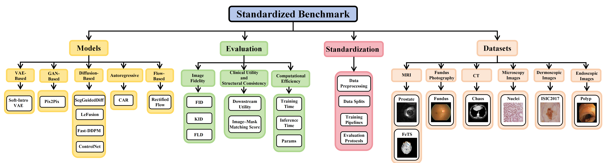
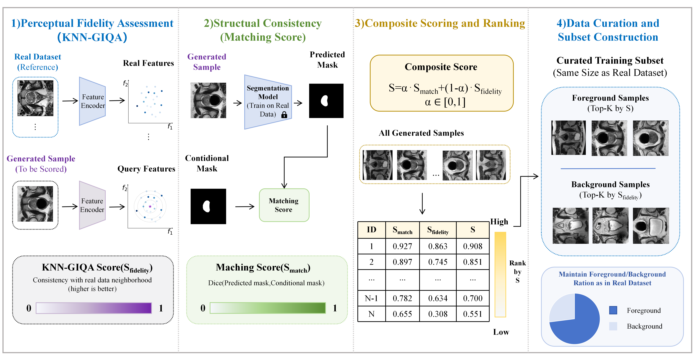

# A Standardized Benchmark of Generative Models Across Medical Imaging Modalities

## Features

- 📊 **Standardized Multi-modality Benchmark**  
  A unified benchmarking framework covering six medical imaging domains, enabling fair comparison across diverse generative models under consistent data preprocessing and mask-to-image protocols.

- 🤖 **Comprehensive Model Coverage**  
  Includes representative paradigms: VAE, GAN, Diffusion, Autoregressive, and Flow-based models.

- 🧪 **Multi-level Evaluation Framework**  
  Combines:
  - Distribution-level metrics (FID, KID, FLD)  
  - Task-level evaluation (Clinical Utility metric in downstream tasks)  
  - Sample-level structural consistency (Image–mask matching score)

- ⚡ **Efficiency Analysis**  
  Evaluates training cost, inference speed, and model size, revealing trade-offs between performance and computational efficiency.

- 🔍 **Sample-level Data Curation**  
  A composite scoring strategy integrating perceptual quality and matching score to select high-quality synthetic data.


---

## Environment Setup

We recommend using Python 3.10 and the following core dependencies:

- Python 3.10.16  
- PyTorch 2.7.0 (CUDA 11.8)  
- torchvision 0.22.0  
- torchaudio 2.7.0  

---


## Dataset

Please place your datasets inside the DATASET/ directory.  
Each dataset must follow a standardized folder structure to ensure compatibility with all models and evaluation scripts.

### 📁 Directory Structure
```bash
DATASET/
├── ISIC/
│   ├── img/
│   │   ├── train/
│   │   │   ├── 0001.png
│   │   │   ├── 0002.png
│   │   │   └── ...
│   │   └── test/
│   │       ├── 0001.png
│   │       └── ...
│   └── masks/
│       └── all/
│           ├── train/
│           │   ├── 0001.png
│           │   └── ...
│           └── test/
│               ├── 0001.png
│               └── ...
│
├── Chaos/
│   └── (same structure as ISIC)
│
└── ...
```

### ⚠️ Important Notes

- Image and mask filenames must be strictly aligned (e.g., `0001.png` ↔ `0001.png`)
- Masks are expected to be grayscale images
- Recommend using PNG format for images
- Ensure consistent resolution across each dataset (e.g., 256×256)

## Usage

### Generative Models

#### (1) Soft-Intro VAE

A mask-guided Soft-IntroVAE is provided for conditional medical image generation.

#### 🔹 Training

Run the following command to train the model:

```bash
python main.py \
  --dataset {DATASET_NAME} \
  --device {DEVICE} \
  --lr 2e-5 \
  --num_epochs 2000 \
  --beta_kl 0.5 \
  --beta_rec 1.0 \
  --beta_neg 1024 \
  --z_dim 256 \
  --batch_size 8
```
📌 Key Arguments

- --dataset : Dataset name 
- --device : cuda or cpu
- --lr : Learning rate
- --num_epochs : Number of training epochs
- --beta_kl : KL divergence weight
- --beta_rec : Reconstruction loss weight
- --beta_neg : Negative Inference weight 
- --z_dim : Latent space dimension
- --batch_size : Training batch size

#### 🔹 Inference 
After training, generate images using:

```bash
python main.py \
  --dataset {DATASET_NAME} \
  --device {DEVICE} \
  --batch_size 16 \
  --seed 2 \
  --option 2 \
  --pretrained {PATH_TO_PRETRAINED_MODEL} \
  --save_dir {PATH_TO_SAVE_GENERATED_IMAGES} \
  --mask_output_dir {PATH_TO_SAVE_MASKS} \
  --start_num 1 \
  --num_size {NUMBER_OF_GENERATED_IMAGES}
```

📌 Key Arguments
- --pretrained : Path to trained model checkpoint
- --save_dir : Directory to save generated images
- --mask_output_dir : Directory to save generated masks
- --num_size : Number of images to generate
- --start_num : Starting index for naming outputs

#### (2) Pix2Pix

Pix2Pix is a conditional GAN-based image-to-image translation model, widely used for mask-guided medical image generation tasks.

---

#### 🔹 Dataset Preprocessing

Before training Pix2Pix, you need to preprocess the dataset into the required format.

```bash
python dataset_preprocessing.py
```

📌 Description
- This script converts the standardized dataset structure into Pix2Pix-compatible format
- The processed dataset will be saved in:
```bash
./datasets/{DATASET_NAME}/
```

#### 🔹 Training

Run the following command to train Pix2Pix:
```bash
python train.py \
  --dataroot {DATASET_PATH} \
  --name {DATASET_NAME} \
  --model pix2pix \
  --direction BtoA \
  --display_id -1 \
  --save_epoch_freq 500 \
  --serial_batches \
  --gpu_ids {DEVICE} \
  --batch_size 32 \
  --n_epochs {N_EPOCHS} \
  --n_epochs_decay {N_EPOCHS_DECAY}
```

📌 Key Arguments
- --dataroot : Path to preprocessed dataset (./datasets/{DATASET_NAME})
- --name : Experiment name (used for checkpoints and logs)
- --direction :
BtoA: mask → image (recommended)
AtoB: image → mask
- --gpu_ids : GPU device id (e.g., 0,1, or -1 for CPU)
- --batch_size : Training batch size
- --n_epochs : Number of epochs with constant learning rate
- --n_epochs_decay : Number of epochs for learning rate decay

#### 🔹 Inference

After training, generate images using:
```bash
python test.py \
  --dataroot {DATASET_PATH} \
  --name {DATASET_NAME} \
  --model pix2pix \
  --direction BtoA \
  --results_dir {RESULTS_DIR} \
  --phase train \
  --num_test {NUM_IMAGES} \
  --gpu_ids {DEVICE} \
  --epoch latest \
  --eval
```

📌 Key Arguments
- --results_dir : Directory to save generated results
- --num_test : Number of images to generate
- --epoch : Which checkpoint to load (latest or specific epoch)
- --phase :
train: use training set
test: use test set

#### (3) minRF

minRF is a Rectified Flow-based generative model designed for efficient and stable medical image generation.

---

#### 🔹 Training

Run the following command to train the model:

```bash
python rf.py \
  --dataset_name {DATASET_NAME} \
  --imgs_path {PATH_TO_IMAGES} \
  --masks_path {PATH_TO_MASKS}
```

#### 🔹 Inference 

After training, generate images using:

```bash
python generate.py \
  --dataset_name {DATASET_NAME} \
  --pretrain {PATH_TO_PRETRAINED_MODEL} \
  --output_dir {PATH_TO_SAVE_GENERATED_IMAGES} \
  --masks_path {PATH_TO_INPUT_MASKS} \
  --mask_output_dir {PATH_TO_SAVE_MASKS} \
  --start_num 1
```

📌 Key Argument
- --pretrain :
Path to the trained model checkpoint used for generation.
This file is produced during the training stage.

#### (4) CAR

CAR is an autoregressive generative framework that builds upon pretrained VQVAE and VAR models for conditional medical image generation.

---

#### 🔹 Step 1: Train VQVAE

```bash
cd VQVAE

python train.py \
  --dataset_name {DATASET_NAME} \
  --data_path {PATH_TO_IMAGES} \
  --resume_path {PATH_TO_PRETRAINED_VAE}
```

📌 Key Argument
- --resume_path :
Path to the pretrained VAE checkpoint (e.g., .pth file).
  - Used to initialize the VQVAE model weights
  - Can be:
    - A pretrained generic VAE (recommended for faster convergence)
    - A previously trained checkpoint (for continuing training)
  - If not provided or invalid, training starts from scratch

#### 🔹 Step 2: Train VAR
```bash
cd VAR

torchrun --nproc_per_node=1 --master_port=12346 train.py \
  --tblr 0.0001 \
  --depth 16 \
  --bs 24 \
  --ep 2000 \
  --fp16 1 \
  --alng 1e-3 \
  --wpe 0.1 \
  --dataset_name {DATASET_NAME} \
  --data_path {PATH_TO_IMAGES} \
  --ge_vae_ckpt {PATH_TO_VQVAE_CHECKPOINT} \
  --ge_var_ckpt {PATH_TO_VAR_CHECKPOINT} \
  --ge_save_path {PATH_TO_SAVE_RESULTS} \
  --save_iter 500
```

📌 Key Arguments
- --ge_vae_ckpt :
Path to the trained VQVAE checkpoint, used to encode images into discrete latent tokens
- --ge_var_ckpt :
Path to a VAR checkpoint
  - If exists → resume training
  - If not → train from scratch
- --ge_save_path :
Directory to save generated samples during training

#### 🔹 Step 3: Preprocess VAR for CAR
```bash
cd CAR
python loading_var.py
```

Converts the trained VAR model into a format compatible with CAR


#### 🔹 Step 4: Train CAR
```bash
torchrun --nproc_per_node=1 --master_port=12345 train.py \
  --tblr 0.0001 \
  --depth 16 \
  --bs 16 \
  --ep 2000 \
  --fp16 1 \
  --alng 1e-3 \
  --wpe 0.1 \
  --seed 2 \
  --local_out_dir_path {PATH_TO_SAVE_CAR_MODEL} \
  --data_path {PATH_TO_IMAGES} \
  --condition_path {PATH_TO_MASKS} \
  --ge_vae_ckpt {PATH_TO_VQVAE_CHECKPOINT} \
  --ge_var_ckpt {PATH_TO_PROCESSED_VAR_CHECKPOINT} \
  --ge_car_ckpt {PATH_TO_CAR_CHECKPOINT} \
  --ge_save_dir {PATH_TO_SAVE_GENERATED_IMAGES} \
  --save_iter 500
```

📌 Key Arguments
- --condition_path :
Path to input masks, used as conditional guidance
- --ge_vae_ckpt :
Pretrained VQVAE model for latent encoding
- --ge_var_ckpt :
Preprocessed VAR checkpoint (from previous step)
- --ge_car_ckpt :
CAR checkpoint path
  - If exists → resume training
  - Otherwise → start new training
- --local_out_dir_path :
Directory to save CAR model checkpoints

#### 🔹 Inference
```bash
python inference_batch.py \
  --dataset_name {DATASET_NAME} \
  --vae_ckpt {PATH_TO_VQVAE_CHECKPOINT} \
  --var_ckpt {PATH_TO_VAR_CHECKPOINT} \
  --car_ckpt {PATH_TO_CAR_CHECKPOINT} \
  --mask_dir {PATH_TO_INPUT_MASKS} \
  --img_output_dir {PATH_TO_SAVE_IMAGES} \
  --mask_output_dir {PATH_TO_SAVE_MASKS} \
  --start_num 0 \
  --seed 2
```

📌 Key Arguments
- --vae_ckpt :
Trained VQVAE model
- --var_ckpt :
Trained VAR model
- --car_ckpt :
Final trained CAR model used for generation
- --mask_dir :
Input masks for conditional generation
- --img_output_dir :
Directory to save generated images
- --mask_output_dir :
Directory to save corresponding masks

#### (5) ControlNet

ControlNet is a conditional diffusion-based model that enables precise image generation guided by structural conditions (e.g., masks).

---

#### 🔹 Training

```bash
python train.py \
  --attr_type {DATASET_NAME} \
  --epochs 100 \
  --gpu {GPU_ID}
```
#### 🔹 Inference

```bash
python infer.py \
  --attr_type {DATASET_NAME} \
  --ckpt {PATH_TO_CHECKPOINT} \
  --images {NUM_IMAGES} \
  --save_path {PATH_TO_SAVE_RESULTS}
```

#### (6) Lefusion

Lefusion is a diffusion-based generative model that supports multi-condition controlled image generation, particularly suitable for medical imaging scenarios with multiple guidance signals.

---

#### 🔹 Training

For dataset , training is executed via shell scripts:

```bash
chmod +x isic_train.sh
./isic_train.sh
```

#### 🔹 Inference

```bash
chmod +x isic_inference.sh
./isic_inference.sh
```

After inference, generated results will be saved under the specified target_img_path:
```bash
target_img_path/
├── Image_1/
├── Image_2/
├── Image_3/
```
- Image_1, Image_2, Image_3 correspond to images generated under different conditions:
  - hist_1
  - hist_2
  - hist_3

Similarly, mask outputs are stored as:
```bash
Mask/
├── Mask_1/
├── Mask_2/
├── Mask_3/
```

#### (7) Fast-DDPM

Fast-DDPM is an accelerated diffusion model that reduces sampling steps while maintaining generation quality, making it suitable for efficient medical image generation.

---

#### 🔹 Training

```bash
python fast_ddpm_main.py \
  --config {CONFIG_FILE} \
  --dataset {DATASET_NAME} \
  --exp {PATH_TO_SAVE_EXPERIMENT} \
  --doc {EXPERIMENT_NAME} \
  --scheduler_type uniform \
  --timesteps 100
```

#### 🔹 Inference
```bash
python fast_ddpm_main.py \
  --config {CONFIG_FILE} \
  --dataset {DATASET_NAME} \
  --exp {PATH_TO_EXPERIMENT} \
  --doc {EXPERIMENT_NAME} \
  --sample \
  --fid \
  --scheduler_type uniform \
  --timesteps 100 \
  --gen {GENERATION_TAG} \
  --seed 2
  ```
📌 Key Arguments
- --scheduler_type :
Defines the time-step sampling strategy used in the diffusion process.
- --timesteps :
Specifies the number of diffusion steps used in the forward and reverse process

#### (8) SegGuidedDif

SegGuidedDif is a segmentation-guided diffusion model that leverages mask information to generate structurally consistent medical images.

---

#### 🔹 Training

```bash
python main.py \
  --mode train \
  --model_type DDPM \
  --img_size 256 \
  --num_img_channels 3 \
  --dataset {DATASET_NAME} \
  --img_dir {PATH_TO_IMAGES} \
  --seg_dir {PATH_TO_MASKS} \
  --train_batch_size 12 \
  --eval_batch_size 8 \
  --num_epochs {EPOCHS} \
  --segmentation_guided \
  --num_segmentation_classes {CLASSES} \
  --seed 2 \
  --save_model_epochs 500
```

#### 🔹 Inference
```bash
python main.py \
  --mode eval_many \
  --model_type DDPM \
  --img_size 256 \
  --num_img_channels 3 \
  --dataset {DATASET_NAME} \
  --eval_batch_size 16 \
  --eval_sample_size {NUM_IMAGES} \
  --seg_dir {PATH_TO_MASKS} \
  --segmentation_guided \
  --num_segmentation_classes {CLASSES} \
  --eval_name train \
  --epoch_num {CHECKPOINT_EPOCH} \
  --cnt 2
```

## Evaluation

To comprehensively assess the performance of generative models in medical imaging, we adopt both distribution-level metrics and sample-level structural consistency metrics.

---

### 🔹 1. Matching Score

We introduce a matching score to evaluate the consistency between generated images and their corresponding anatomical structures.

#### 📌 Method Overview

- A segmentation model (e.g., nnUNet-v2) is first trained on the real dataset
- The trained model is then applied to generated images to obtain predicted masks
- The Dice coefficient is computed between:
  - predicted masks  
  - original input masks  
- The final score is averaged over all samples

A higher matching score indicates better anatomical consistency and structural fidelity.

#### 📌 Key Characteristics

- Operates at the individual sample level
- Reflects structural correctness, not just visual similarity
- Provides a foundation for data curation and filtering

---

#### 🔹 Step 1: Pretrain Segmentation Model (nnUNet-v2)

Before computing the matching score, train a segmentation model on the real dataset.

#### 🔹 Step 2: Compute Matching Score
```bash
python matching_score.py \
  --name {DATASET_NAME} \
  --way {METHOD_NAME} \
  --filepath {OUTPUT_FILE} \
  --seg_dir {PATH_TO_GROUND_TRUTH_MASKS} \
  --pre_dir {PATH_TO_PREDICTED_MASKS} \
  --num_classes {NUM_CLASSES}
```

📌 Key Inputs
- --seg_dir : Ground truth masks (input conditions)
- --pre_dir : Predicted masks from nnUNet-v2
- Both directories must have aligned filenames

The matching score will be saved in the score_list folder.

### 🔹 2. Distribution-level Metrics

To evaluate the overall distribution similarity between generated and real images, we compute:
- FID (Fréchet Inception Distance)
- KID (Kernel Inception Distance)
- FLD (Feature-level Distribution Distance)

```bash
python quality.py \
  --dataset_name {DATASET_NAME} \
  --generate_name {GENERATED_DATASET_NAME}
```

## Data Curation

In practical applications, generated samples often exhibit significant variability in both visual quality and structural plausibility. Directly using all synthetic data may introduce noisy or low-quality samples, which can degrade downstream performance.

To address this issue, we propose a sample-level utility evaluation and data curation strategy, which selects high-quality synthetic samples for downstream tasks (e.g., segmentation).


---

### 🔹 Method Overview

Our data curation strategy integrates two complementary dimensions:

- Perceptual Quality (image realism)
- Structural Consistency (anatomical correctness)

Each generated sample is assigned a composite score, based on which samples are ranked and selected.

---

### 🔹 1. Perceptual Quality Assessment

- We adopt KNN-GIQA from the GIQA framework  
- Measures similarity between generated samples and real data in feature space  
- Captures:
  - fine-grained texture details  
  - global visual realism  
- All scores are normalized to ensure consistency across datasets

---

### 🔹 2. Structural Consistency

- Measured using the Matching Score introduced in the Evaluation section  
- Reflects alignment between:
  - generated image  
  - corresponding input mask  
- Provides a measure of anatomical interpretability

---

### 🔹 3. Sample Data Curation

#### Case 1: Datasets without background distinction

```bash
python select_no_bg.py \
  --quality_path {QUALITY_SCORE_FILE} \
  --match_path {MATCH_SCORE_FILE} \
  --save_path {OUTPUT_SELECTION_FILE} \
  --alpha {WEIGHT} \
  --top_k {NUM_SELECTED_SAMPLES}
```

#### Case 2: Datasets with foreground/background distinction

```bash
python select_bg.py \
  --quality_path {QUALITY_SCORE_FILE} \
  --match_path {MATCH_SCORE_FILE} \
  --mask_dir {PATH_TO_MASKS} \
  --save_path {OUTPUT_SELECTION_FILE} \
  --alpha {WEIGHT} \
  --topk_fg {NUM_FOREGROUND} \
  --topk_bg {NUM_BACKGROUND}
```

## Acknowledgements

We thank the following repos for the code sharing:

1. **Soft-Intro VAE**: https://github.com/taldatech/soft-intro-vae-pytorch
2. **Pix2Pix**: https://github.com/phillipi/pix2pix
3. **minRF**: https://github.com/cloneofsimo/minRF
4. **CAR**: https://github.com/MiracleDance/CAR
5. **ControlNet**: https://github.com/lllyasviel/ControlNet
6. **LeFusion**: https://github.com/HINTLab/LeFusion
7. **Fast-DDPM**: https://github.com/mirthAI/Fast-DDPM
8. **SegGuidedDif**: https://github.com/mazurowski-lab/segmentation-guided-diffusion
9. **GIQA**: https://github.com/cientgu/GIQA
10. **FLD**: https://github.com/marcojira/fld
